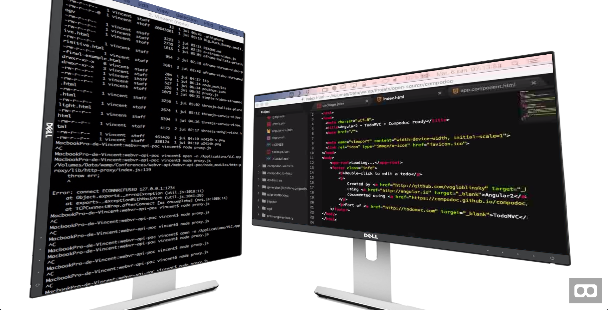

# Desktop streaming to an A-Frame world

Streaming desktop windows to an A-Frame 3D world



## Requirements

- PC or Mac
- VLC video player

## Setup

### 1. Source screens

- Terminal in size 450x800px
- Atom in size 800x450px
- two VLC app opened, one for each previous app which will be streamed

```
open -n /Applications/VLC.app
```

- use this tutorial to start streaming each part of the screen

http://blog.mgechev.com/2014/12/31/stream-desktop-html5-video-vlc/

- config screen 1 :

x : 0
y : 0
width : 450
height: 800

- config screen 2 :

x : 640
y : 0
width : 450
height: 800

### 2. Node.js proxy

VLC stream doesn't have the HTTP header `Access-Control-Allow-Origin`, so this Node.js proxy is just here to add it.

```
npm i
node proxy.js
```

### 3. Open the test page :

http://YOURLOCALHOST/src/simple-video-streamed.html

### 4. Open the final page :

http://YOURLOCALHOST/src/

and enjoy
